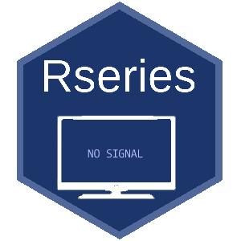

# Rseries 


<!-- badges: start -->

[](https://github.com/healthinnovation/lis/actions)
[](https://www.tidyverse.org/lifecycle/#experimental)

[](https://www.repostatus.org/#active)

<!-- badges: end -->

## **Description**

This package contains beauty palettes to personalize plots with the style of series of  plataforms like Netflyx, Amazon Prime  or local TV from Latin American Countries


## **Package installation**

You can install the first version of Rseries from
[GitHub](https://github.com/):

The following code just copy and paste into the R console:

```
if(!require("remotes")) install.packages("remotes")
remotes::install_github("Diognes/Rseries")
```

```
library(Rseries)
```
