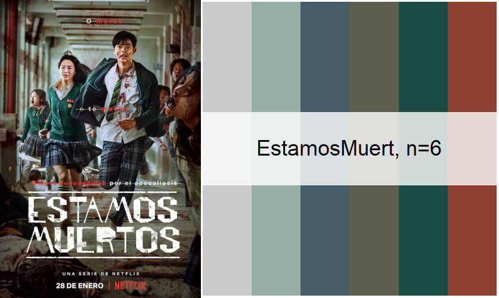
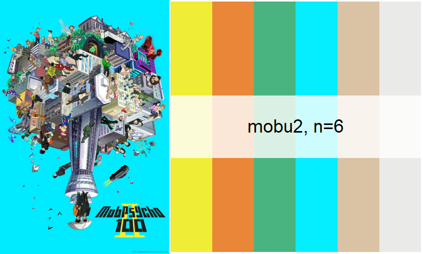
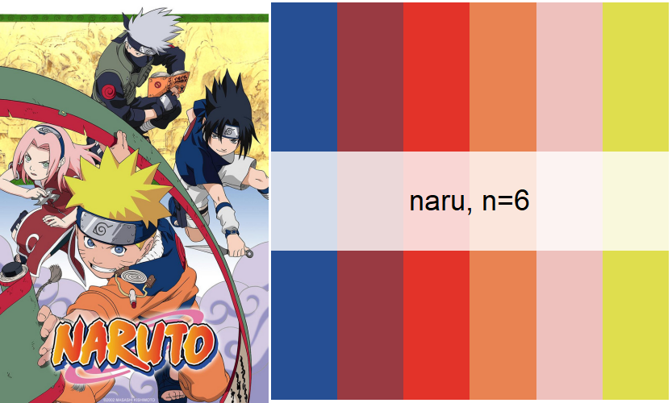
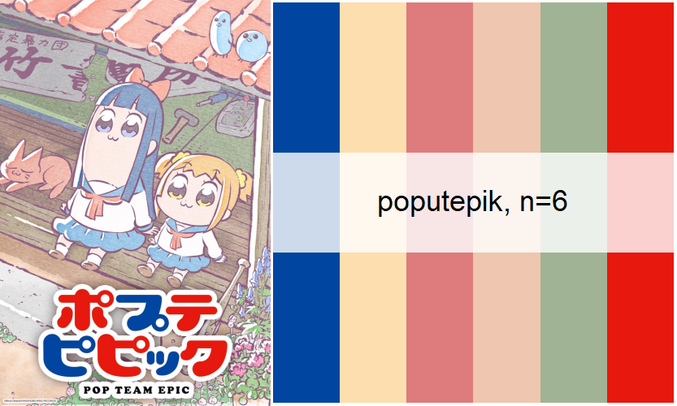
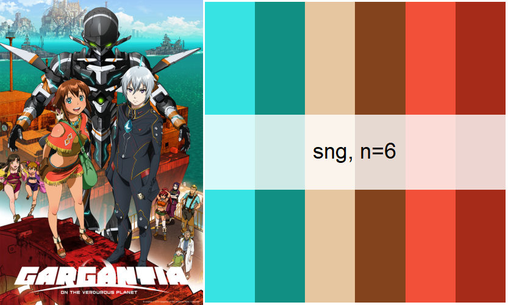
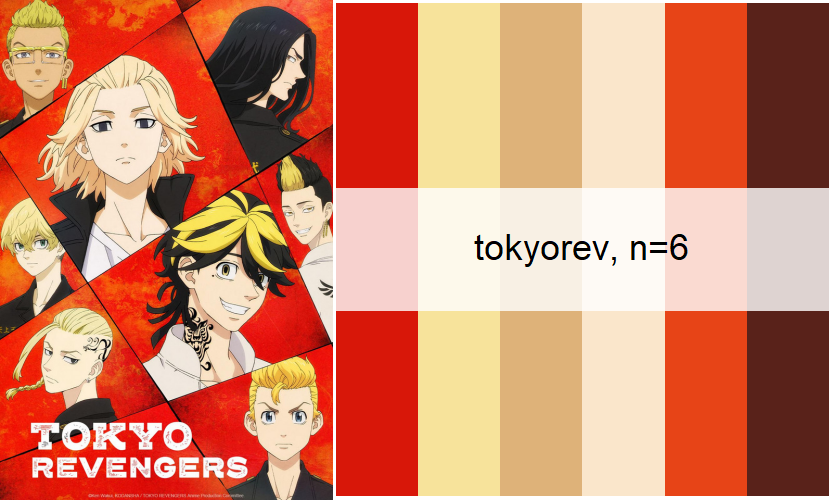
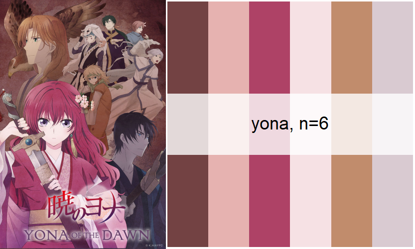

# A showcase of some palettes

```{r setup, include=FALSE}
knitr::opts_chunk$set(echo = TRUE,warning=FALSE,message=FALSE,fig.align="center")
```


## palette_netflyx

### lupin | Lupin


### GambitoDama | Gambito de dama


### EstamosMuert | Estamos Muertos


## palette_anime

### asobi | Asobi Asobase


### bolt | Boruto


### cardcaptor | Cardcaptor Sakura


### ggo | SAO Alternative: Gun Game Online


### hataraku | Cells at Work!


### mobu2 | Mob Psycho 100 II


### naru | Naruto


### nichi | Nichijou


### poputepik | Pop Team Epic


### sng | Suisei no Gargantia


### takt | Takt Op.Destiny


### tokyorev | Tokyo Revengers


### yona | Akatsuki no Yona


### yuri | Yuri!!! on Ice


### yuru2 | Yuru Camp△


